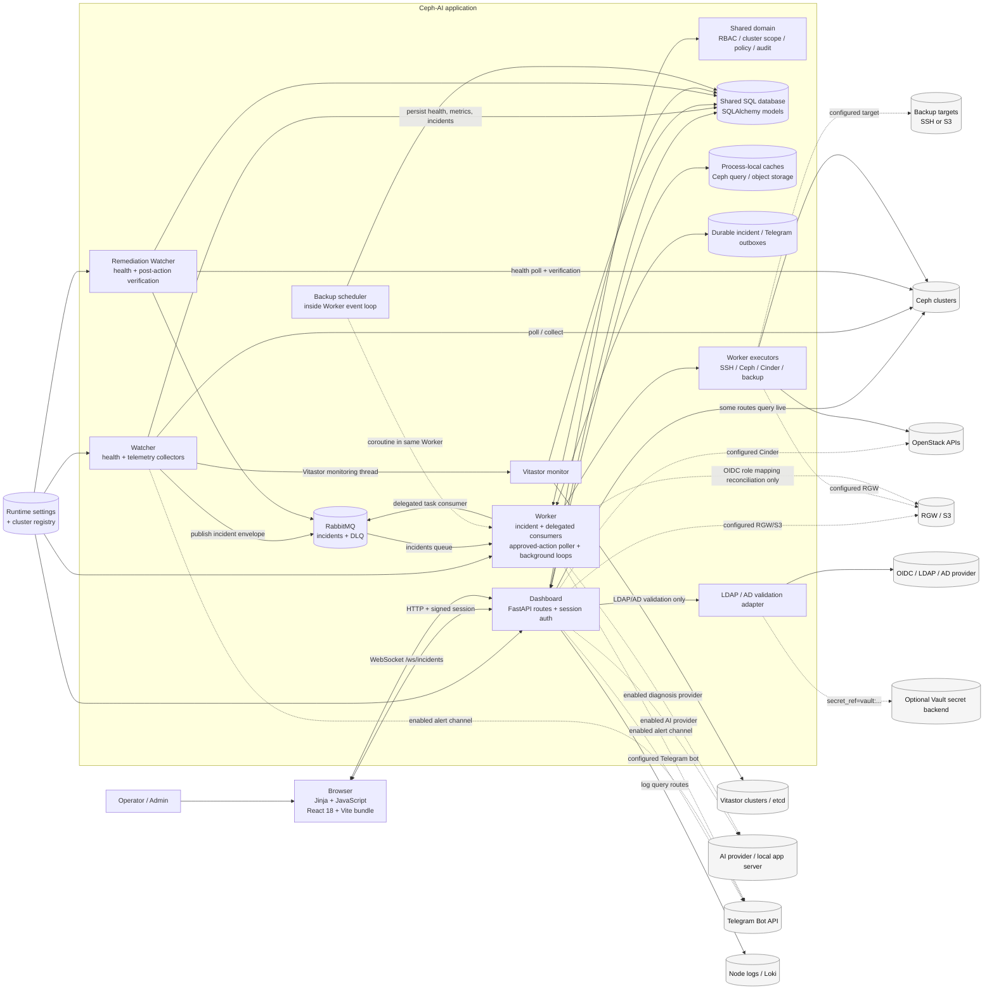
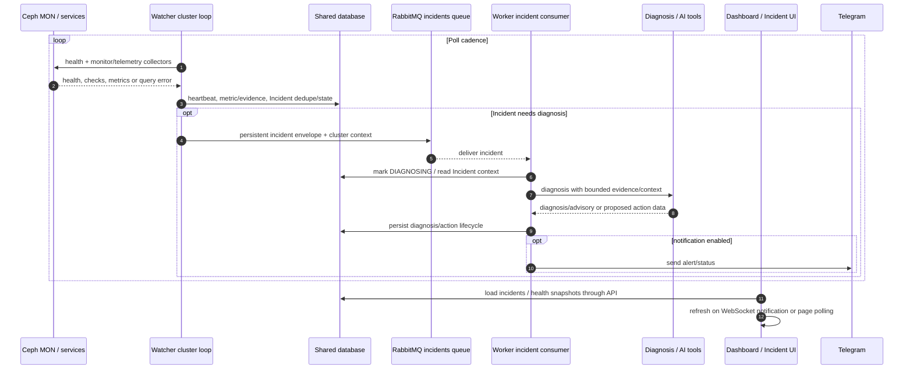
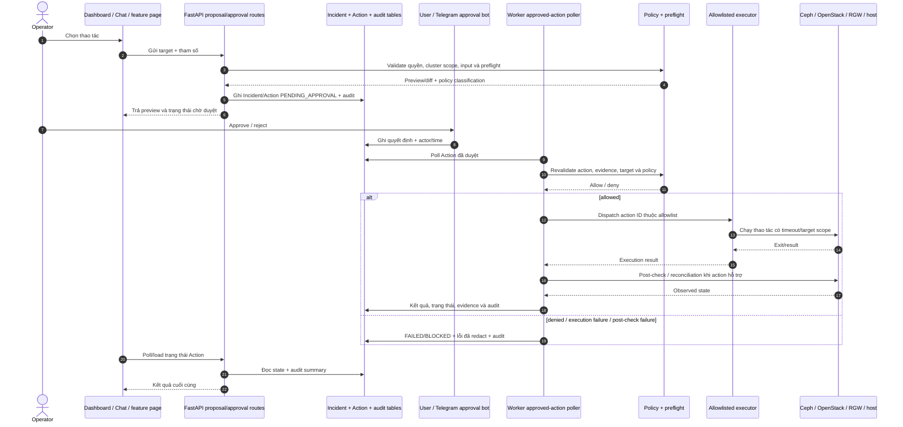
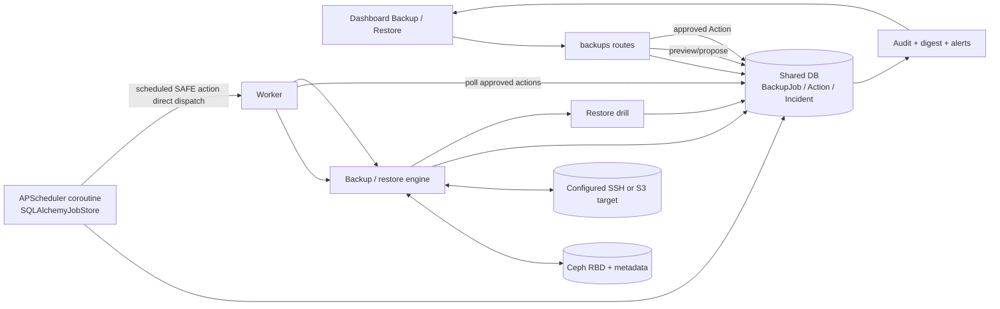
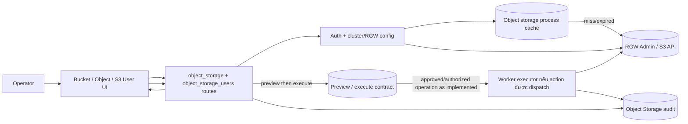
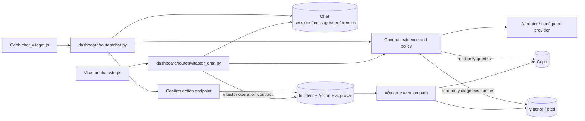

# Sơ đồ kiến trúc Ceph-AI

Tài liệu này mô tả kiến trúc theo mã nguồn trong checkout được đọc khi tạo sơ
đồ. Đây là bản đồ để review thay đổi và chọn kiểm thử hồi quy; không phải cam
kết rằng mọi API đều dùng chung một collector hay mọi cập nhật đều realtime.

## Phạm vi và cách đọc

- Mã nguồn xác định các luồng: `dashboard/app.py`, `watcher/main.py`,
  `watcher/remediation_main.py`, `worker/main.py`, `shared/mq.py` và các router.
- Luồng Ceph và Vitastor là hai product context riêng. Chúng có thể dùng chung
  process infrastructure/DB nhưng có model, API, credentials và UI riêng.
- Một số API Dashboard truy vấn Ceph/RGW/OpenStack trực tiếp; một số dùng
  process cache hoặc dữ liệu đã lưu. Hãy xem từng API cụ thể trước khi kết
  luận độ trễ hay nguồn dữ liệu.
- Sơ đồ lõi không đồng nghĩa mọi cài đặt đều bật đủ tích hợp. Các cạnh có điều
  kiện phụ thuộc cấu hình được liệt kê ở phần cấu hình triển khai và trong
  `deployment_variants` của graph.
- Đường liền trong sơ đồ là quan hệ đã đọc thấy trong code; có thể chỉ chạy
  khi cấu hình bật. Đường nét đứt là code path có điều kiện cấu hình.
  `Not wired` ghi rõ một kết nối mà sơ đồ impact cần biết là hiện chưa có.
- Graph có ID tương ứng trong
  [`tests/architecture/graph.yaml`](../../tests/architecture/graph.yaml).

## 1. System context và thành phần runtime



Đường nét đứt biểu thị integration có điều kiện theo cấu hình. Worker thực tế
chạy nhiều loop độc lập (incident consumer, delegated-AI consumer,
approved-action poller, backup scheduler, bucket logging, RGW audit,
Telegram/incident outbox và heartbeat); không phải mọi loop đều cần cấu hình
external service tương ứng.

### Process ownership

| Process | Trách nhiệm quan sát được | Tài nguyên dùng chung |
| --- | --- | --- |
| Dashboard | HTML/API, auth/session, chat, CRUD và preview/approval; một số truy vấn read-only tới backend | DB; một số cache trong process; Telegram chat/approval listener chỉ khởi động khi `telegram_listener_enabled` |
| Watcher | Poll health và collectors; ghi heartbeat/metrics/incident; phát incident envelope; các loop theo cluster | DB, RabbitMQ, SSH/Ceph; Vitastor loop riêng được khởi chạy từ `run_all_clusters()` |
| Remediation Watcher | Poll health nhanh, reconcile Incident/Action và verify kết quả sau hành động; phát incident cần chẩn đoán | DB, RabbitMQ, SSH/Ceph |
| Worker | Incident + delegated-AI consumers; approved-action poller; backup scheduler; bucket logging; RGW audit; Telegram/incident outbox dispatch/reconcile; heartbeat | DB, RabbitMQ; các kết nối SSH/Ceph, AI, backup target, RGW/S3 chỉ theo loop/action cần dùng |

Dashboard còn cài các middleware dùng chung cho request ID, API observation,
rate limiting, CSRF trong production, trusted proxy/host validation, security
audit, redaction và session. Đây là dependency ngang: thay đổi middleware có
thể ảnh hưởng mọi router dù file route không đổi.

## 2. Luồng đọc và hiển thị dữ liệu

```mermaid
sequenceDiagram
  autonumber
  actor User as Operator
  participant UI as Browser UI
  participant Auth as Dashboard auth/session
  participant Route as FastAPI route
  participant Scope as Cluster/pool scope
  participant Cache as Process cache (nếu route dùng)
  participant DB as Shared database
  participant Ceph as Ceph/RGW/OpenStack

  User->>UI: Mở trang hoặc yêu cầu refresh
  UI->>Auth: HTTP request với signed session cookie
  Auth->>Route: Kiểm tra đăng nhập, product và quyền
  Route->>Scope: Resolve selected cluster + allowed resource scope
  alt API có dữ liệu cache
    Scope->>Cache: Đọc key có cluster/resource scope
    alt cache hit
      Cache-->>Route: cached data + metadata nếu endpoint cung cấp
    else cache miss / refresh
      Cache->>Ceph: Query bounded theo endpoint
      Ceph-->>Cache: result hoặc lỗi
      Cache-->>Route: fresh result hoặc stale/error tùy contract
    end
  else API đọc dữ liệu đã lưu
    Scope->>DB: Query có cluster_id/time/resource filter
    DB-->>Route: snapshot / metrics / job / audit
  else API có truy vấn live trực tiếp
    Scope->>Ceph: Query qua ceph_client hoặc integration client
    Ceph-->>Route: result hoặc timeout/error
  end
  Route-->>UI: JSON/HTML; hình dạng stale/partial tùy API
```

**Lưu ý impact:** không suy ra toàn Dashboard được bảo vệ bởi cache từ một API
có cache. Khi sửa `ceph_client`, cluster scope, cache contract, response model
hoặc polling JavaScript, lần theo tất cả route/page consumer trong graph.

## 3. Luồng Watcher, Incident và chẩn đoán AI



`watcher/remediation_main.py` là process riêng cho polling sức khỏe và
post-action verification. `watcher/main.py` có default/observed cluster loops
và một Vitastor monitoring thread; collectors phụ có thể chạy tách nền. Worker
queue dùng retry header và dead-letter topology do `shared/mq.py` khai báo.

**Realtime hiện tại:** `/ws/incidents` (`dashboard/ws.py`) kiểm tra fingerprint
của Incident trong DB theo chu kỳ 2 giây rồi gửi `incidents_changed` khi có
thay đổi. Đây không phải push trực tiếp từ RabbitMQ. Sơ đồ chưa thấy một
`action_state_changed` event dùng chung nối tới mọi UI consumer; không giả định
mọi Action update sẽ đẩy realtime tới mọi trang.

## 4. Luồng Action, approval, execution và audit



Một số workflow đặc biệt có orchestration riêng. Ví dụ backup schedule ở
`worker/backup/scheduler.py` tạo synthetic Incident/Action trạng thái SAFE và
dispatch trực tiếp `_execute_approved_action()` trong Worker; nó không đi qua
RabbitMQ incidents queue. Phải giữ nhánh này riêng trong graph và test.

## 5. Backup, restore và dữ liệu ngoài cụm



Backup scheduler chạy trong cùng event loop Worker với queue consumer,
approved-action poller và bucket logging. Luồng restore từ giao diện có proposal
/approval và engine riêng; restore drill theo policy không đồng nghĩa đã có
nghiệm thu DR trên dữ liệu thật.

Incident và Telegram notification còn đi qua durable outbox để tách transaction
ghi DB khỏi việc gửi broker/bot; Worker dispatch và reconcile outbox nền.
Delegated AI dùng consumer/queue riêng, không phải incident queue.

## 6. Object Storage và S3 identity



Các endpoint inventory, detail, key/user settings và bucket governance có
contract riêng. Khi sửa, xác định trước thao tác nào được thực thi trong route
và thao tác nào được chuyển qua Worker; không coi mọi mutation của Object
Storage là cùng một executor path.

## 7. Chat AI và product boundary



Ceph và Vitastor giữ route, session namespace/product authorization, cluster
models/client và action policy riêng. Shared AI libraries hoặc shell/template
không có nghĩa hai product được phép dùng lẫn cluster credentials.

## 8. Quyền, cluster scope và dữ liệu

- Browser dùng signed session cookie; Dashboard kiểm tra login và product
  namespace. Các route áp dụng dependency/role check theo endpoint.
- Ceph cluster context đến từ session/selector hoặc request parameter được
  kiểm tra với cluster đang hoạt động và resource scope. Worker cần giữ đúng
  `cluster_id`/connection context của Incident hoặc Action.
- Shared DB lưu cluster, Incident, Action, audit, metrics, backup, chat và các
  snapshot/model chuyên biệt; process caches không tự đồng bộ giữa process.
- Secret/SSH credentials phải được resolve theo cluster và không đưa vào
  browser response, event/log hay graph artifact.
- Migrations trong `alembic/` tác động model/route/worker readers và writers;
  schema change phải lan test tới tất cả consumer.

## 9. Kiến trúc lõi và biến thể theo từng nơi cài

Đúng, luồng cụ thể phụ thuộc nơi cài và cấu hình vận hành. Sơ đồ lõi mô tả
những thành phần có trong code; mỗi deployment chỉ có một phần cạnh tới hệ
thống ngoài hoặc collector hoạt động. Cần tách hai câu hỏi:

| Phần kiến trúc | Tương đối cố định theo code | Thay đổi theo deployment |
| --- | --- | --- |
| Dashboard/API, Watcher, Worker, DB và policy | Có | Có thể tách process/container hoặc dùng backing service khác |
| Ceph connection | Client/command boundary trong code | Số cluster, node/role, SSH identity, mode `docker`/`podman`/`cephadm`/`none`, version và quyền Ceph |
| Object Storage | Các route/client và worker path | RGW có cấu hình hay không, endpoint, access mode, audit/metric toggles |
| OpenStack/Cinder | Adapter và routes có trong code | Controller/credential có sẵn, version/API reachability, volume naming/mapping |
| AI | Adapter, context/policy boundary | Provider/endpoint, enable flag, model/capability, credential, network access |
| Backup/restore | Engine, scheduler, DB state | Có tracked image/policy không; target A/B dùng SSH hay S3; retention/immutability |
| Logs | Adapter interface và query pipeline | SSH collection hay Loki, node reachability, retention và source completeness |
| Telegram | Notifier/approval listener code | Bot/channel/token, quyền approver, feature toggles; một số listener chỉ chạy khi có token |
| Vitastor | Product riêng với route/client/model riêng | Có bật product và khai báo cluster active hay không; không dùng Ceph cluster scope |
| Federated IAM/Vault | Route/worker integration code | Provider, Vault address/credentials, RGW federation capability và policy |

Vì vậy graph cần có **profile triển khai**, ngoài topology code chung. Profile
được tạo từ cấu hình đã redact của từng môi trường và chỉ ghi cờ/capability,
không ghi secret. Khi profile thay đổi (ví dụ thêm RGW hoặc đổi backup target
SSH sang S3), impact selector phải bật các cạnh điều kiện tương ứng và chạy
integration contract của luồng đó. Khi chưa có profile, chạy coverage theo
toàn bộ biến thể code đã hỗ trợ hoặc fallback full non-live suite.

Manifest hiện ghi nhận các lớp biến thể và điều kiện, nhưng chưa có profile
được tạo cho từng máy cài cụ thể. Cần đối chiếu capability thực tế, Ceph
release và cấu hình đã redact ở từng nơi trước khi dùng graph để quyết định
không chạy một nhóm test.

### Federation: provider và mức hỗ trợ hiện tại

Dashboard hỗ trợ cấu hình/kiểm tra OIDC và LDAP/AD. `shared/ldap_identity.py`
thực hiện directory bind/group lookup và có thể resolve secret reference từ
environment, file cho phép hoặc Vault. Đây không đồng nghĩa mọi provider đã
được nối end-to-end vào RGW: Worker reconciliation của role mapping hiện chỉ
hỗ trợ OIDC. Vì vậy profile cài đặt phải ghi riêng `provider_type`, secret
backend và capability thực thi; không gộp chúng thành một cờ “federation bật”.

`dashboard/routes/ai_tasks.py` tồn tại/import được nhưng router hiện không được
đăng ký bằng `include_router` trong `dashboard/app.py`; nó không phải API đang
phục vụ. Graph đánh dấu riêng để tránh kiểm thử nhầm route chưa mount như tính
năng hoạt động.

## 10. Quy tắc dùng sơ đồ để khoanh vùng test

1. Ghép changed path với node `source` trong graph manifest.
2. Theo cạnh tới component consumer, API/page, event/data contract, permission
   boundary, external dependency và test.
3. Chọn test theo cả luồng nghiệp vụ và failure path; dùng permission/cluster
   scope như cạnh bắt buộc, không chỉ theo import.
4. Nếu path chưa map, graph thiếu node/edge critical, hoặc selection không chắc
   chắn, chạy full non-live suite và ghi graph gap vào impact report.
5. Thay đổi route, event, schema, permission, lifecycle hay retry/timeout phải
   cập nhật cả manifest và diagram trong cùng thay đổi code.

### Tạo bản đồ theo installation

Trang `/stream` trong nhóm Monitoring & Metrics dựng canvas theo profile của
installation đang chạy. Trang chỉ dành cho admin; node và cạnh là bản đọc cấu
hình, không phải kiểm tra kết nối hay thực thi workflow. React hiển thị sơ đồ
SVG tương tác, còn API trang tổng hợp profile trực tiếp từ settings/database.
Route, profile builder và test được map tại node
`dashboard.installation_stream`, `shared.installation_profile` và flow
`flow.installation_stream` trong manifest.

Mỗi thành phần trên Stream liên kết tới các node, flow, quan hệ và test trong
manifest `tests/architecture/graph.yaml`. Profile chỉ chuyển metadata cần để
hiển thị các liên kết này; các đường dẫn cấu hình và credential không được đưa
vào browser. Manifest cũng được đóng gói thành `docs/architecture/graph.yaml`
trong image runtime để trang có thể giải quyết liên kết khi thư mục `tests/`
không được cài đặt.

Trên từng installation, chạy từ thư mục gốc repository:

```bash
.venv/bin/python scripts/architecture_profile.py \
  --output /var/lib/ceph-ai/architecture/installation-profile.json \
  --mermaid-output /var/lib/ceph-ai/architecture/installation-flow.mmd
```

Lệnh đọc settings và các cluster/provider record trong database, không gọi Ceph,
RGW, OpenStack hay AI provider. File được ghi atomically với mode `0600`; nội
dung chỉ gồm feature status, số lượng node theo role, execution mode và loại
provider. IP, tên cluster, URL, đường dẫn key, token và secret không được xuất.
Chạy lại sau khi cấu hình thay đổi để làm mới profile. Hiện đây là thao tác CLI
tường minh, chưa tự chạy khi settings thay đổi; profile không được commit vào
repository dùng chung.

## Nguồn code chính

`dashboard/app.py`, `dashboard/routes/`, `dashboard/ws.py`,
`dashboard/cluster_scope.py`, `dashboard/static/`, `dashboard/templates/`,
`ceph-health-dashboard/src/`, `watcher/main.py`, `watcher/remediation_main.py`,
`watcher/collector.py`, `watcher/publisher.py`, `worker/main.py`,
`worker/llm/router_client.py`, `worker/executor/`, `worker/backup/`,
`shared/mq.py`, `shared/db.py`, `shared/models.py`, `shared/clusters.py`.
