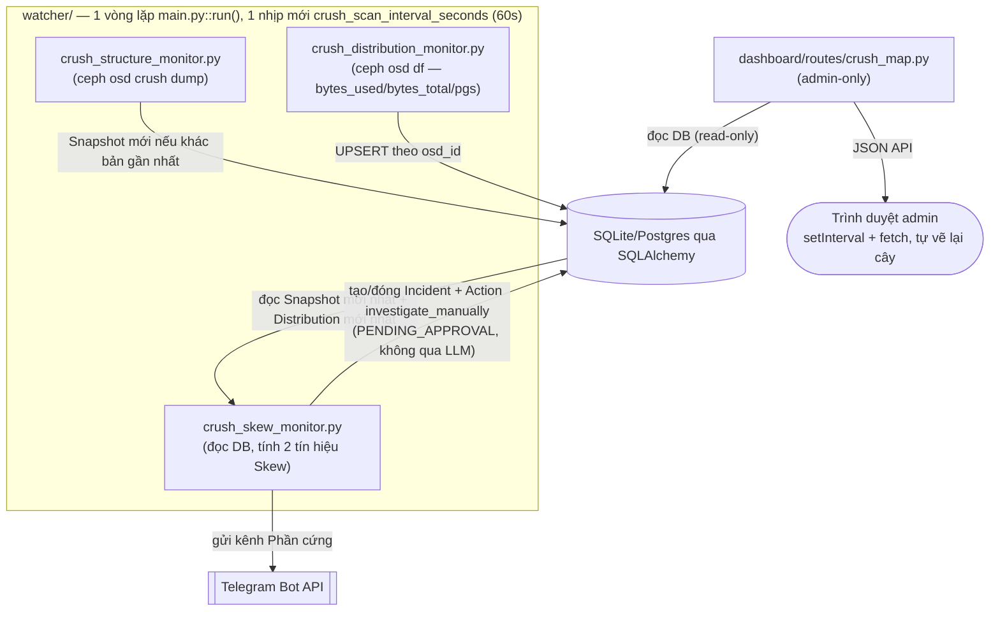
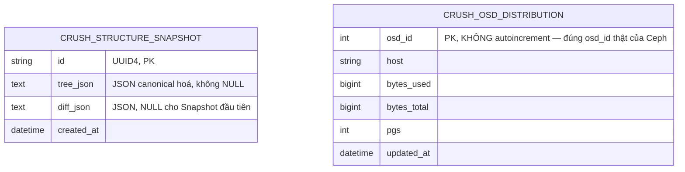

# Giám sát dòng chảy dữ liệu CRUSH Map (Epic 12)

Tài liệu này mô tả tính năng **CRUSH Map** trong Ceph AIOps Dashboard:
trang cây CRUSH tương tác (admin-only, `/crush-map`) hiển thị cấu trúc
Root→Rack→Host→OSD kèm Weight, overlay %USE/số PG thực tế lên từng
node, kèm lịch sử thay đổi cấu trúc, cộng với một cơ chế phát hiện lệch
tải (Skew) tự động tạo Incident + gửi Telegram khi một OSD/Host gánh tải
lệch bất thường so với Weight của nó.

Nguồn: `prd-ceph-crush-map-monitor-2026-08-07/prd.md`,
`architecture-ceph-crush-map-monitor-2026-08-07/ARCHITECTURE-SPINE.md`
(AD-25..AD-32), `epics.md` (Epic 12, FR58-67/NFR20-22), 3 story file
`12-1-nen-tang-thu-thap-cau-truc-crush-phan-phoi-du-lieu.md` /
`12-2-phat-hien-lech-tai-canh-bao-tu-dong.md` /
`12-3-trang-dashboard-cay-crush-tuong-tac.md`. Cả 3 story hiện ở
`Status: review` — đã có code, test, commit riêng cho từng story
(`2df7907`, `862651e`, `336d798`). **2026-08-10: đã chạy `/code-review
high`** (3 lớp Blind Hunter/Edge Case Hunter/Acceptance Auditor) — 8
patch finding đã fix ngay (xem mục 10), 10 defer finding ghi vào
`deferred-work.md` (gồm 1 finding mức độ nghiêm trọng nhất: 3 commit của
Epic 12 không tự đủ — guard AD-32/2 model/hàm gửi Telegram thực ra nằm
trong 1 commit không liên quan trước đó, `main` từng không import được
trong khoảng ~11h giữa 2 commit đó; vô hại ở HEAD hiện tại, chỉ là vấn đề
tính toàn vẹn lịch sử commit). Vẫn CHƯA xác nhận đúng field JSON trên một
cụm Ceph thật (xem mục 7).

## 1. Vì sao tính năng này tồn tại

Ceph không có counter I/O thời gian thực theo từng nhánh CRUSH — "giám
sát dòng chảy dữ liệu" ở đây KHÔNG có nghĩa xem dữ liệu chạy qua dây
theo thời gian thực, mà là gộp các lệnh CLI vận hành viên hiện phải tự
chạy (`ceph osd crush dump`, `ceph osd df tree`) + tự nhẩm tính, thành
một màn hình tự động phát hiện sớm 3 tình huống vận hành thật:

- Một OSD/host đang gánh tải nhiều hơn hẳn phần Weight của nó quy định
  (reweight sai, hoặc phần cứng đang lệch tải thật).
- Vừa thêm/xoá OSD hoặc đổi CRUSH rule, muốn xác nhận thay đổi áp dụng
  đúng ý đồ (đúng Root/Rack/Host, đúng Weight).
- Đang debug một Incident khác (vd `OSD_LATENCY_HIGH:<id>`) và cần xem
  OSD đó nằm ở đâu trong cây, host/rack đó có đang lệch tải không.

Trang giới hạn **admin-only** (giống Alert Telegram/Users, khác
Nodes/Volumes) — quyết định của PM vì đây vừa là cấu hình nhạy cảm vừa
là nơi phát sinh cảnh báo Incident.

## 2. Kiến trúc tổng quan

Mở rộng đúng khuôn Event-Driven Pipeline đã có trong `watcher/`: 2
module **thu thập thuần** (không alerting, không import
`shared.audit`) nuôi dữ liệu cho 1 module **cảnh báo** tái dùng verbatim
vòng đời Incident/Action/Telegram sẵn có.



| Lớp | Module | Vai trò |
|---|---|---|
| Thu thập thuần (F1) | `watcher/crush_structure_monitor.py` | Chụp + dedup + diff cây CRUSH |
| Thu thập thuần (F3) | `watcher/crush_distribution_monitor.py` | Tổng hợp %USE/PG thực tế mỗi OSD |
| Cảnh báo (F4) | `watcher/crush_skew_monitor.py` | Tính Skew + vòng đời Incident/Telegram |
| Điều phối nhịp quét | `watcher/main.py::run()` | +1 biến `last_crush_scan_at`, +1 guard trong `_resolve_recovered_incidents()` |
| Presentation (F2) | `dashboard/routes/crush_map.py`, `dashboard/static/crush_map.js`, `dashboard/templates/crush_map.html` | Trang cây tương tác + JSON API |
| Shared Kernel | `shared/models.py` (`CrushStructureSnapshot`, `CrushOsdDistribution`) | Schema, DB |

**Không có FK** giữa 2 bảng CRUSH và `incidents`/`actions` —
`crush_skew_monitor.py` đọc cả 2 bảng bằng truy vấn độc lập rồi mới
quyết định tạo `Incident` thường, đúng khuôn `node_health_monitor.py`/
`osd_latency_monitor.py` (2 module đó cũng không có bảng riêng cho
chính mình). Dashboard (`crush_map.py`) **không import** bất kỳ gì từ
`watcher/crush_*.py` hay `worker/executor/` — chỉ đọc DB qua ORM
(`shared/db.py`), giữ đúng ranh giới AD-3 của spine gốc.

## 3. F1 — Bản chụp cấu trúc CRUSH + lịch sử thay đổi

`watcher/crush_structure_monitor.py::scan_and_store()`, gọi mỗi tick
`crush_scan_interval_seconds`:

1. `capture_crush_structure()` chạy `ceph osd crush dump`, parse
   `devices`/`buckets` (flat) thành cây lồng nhau
   Root→Rack→Host→OSD (`_build_tree()`). Trả `None` (không raise) nếu
   lệnh lỗi — một lượt quét lỗi chỉ bỏ qua đúng lượt đó, giữ nguyên
   Snapshot gần nhất.
2. `_canonicalize()` chuẩn hoá cây thành JSON string ổn định: không
   chỉ `sort_keys=True` (chỉ sort *key* của object) mà còn tự sort
   từng mảng con (`children`) theo `id` (`_sort_tree()`) — vì
   `ceph osd crush dump` có thể trả `items`/`buckets` theo thứ tự
   khác nhau giữa 2 lần gọi dù cấu trúc thật giống hệt nhau. Thiếu
   bước sort mảng này, dedup ở bước 3 sẽ báo "thay đổi" giả liên tục.
3. So chuỗi canonical với `CrushStructureSnapshot` mới nhất
   (`ORDER BY created_at DESC LIMIT 1`) — giống thì không ghi gì; khác
   thì ghi Snapshot mới + `diff_json` (`_compute_diff()`: Bucket/OSD
   nào `added`/`removed`/`reweighted`, kèm Bucket rỗng). Snapshot ĐẦU
   TIÊN sau khi bật tính năng luôn được ghi, `diff_json=None` (không
   có baseline để so).

**Một OSD chỉ đổi trạng thái up/down (không đổi Weight/vị trí) KHÔNG
được tính vào diff** — `_build_tree()` không đọc trạng thái up/down của
OSD (đó là phạm vi Incident `OSD_DOWN` riêng, không liên quan module
này).

### 3.1. Lỗi Weight-per-OSD đã được sửa trong Story 12.2

`ceph osd crush dump`'s OSD leaf (`devices[]`) không mang Weight của
chính nó — Weight của một OSD chỉ tồn tại trên **item của bucket cha**
tham chiếu tới nó (`bucket.items[].weight`). Bản đầu của `_build_tree()`
luôn set `weight: None` cho mọi OSD leaf; đã sửa bằng cách truyền
`item_weight` xuống qua đệ quy `resolve()`. **Một `CrushStructureSnapshot`
ghi TRƯỚC bản sửa này vẫn có `weight: None` trên mọi OSD** trong
`tree_json` đã lưu — `crush_skew_monitor.py` phải dung nạp trường hợp
đó (coi là "không có dữ liệu Weight", không crash) khi đọc lại các
Snapshot cũ.

## 4. F3 — Tổng hợp phân phối dữ liệu theo OSD

`watcher/crush_distribution_monitor.py::sync_distribution()`, chạy
**cùng tick** với F1 (không phải nhịp riêng — xem mục 6):

- `ceph osd df --format json` trả cả `kb`/`kb_used` (nhân 1024 ra
  `bytes_total`/`bytes_used` — lưu **byte thô**, không lưu %USE đã
  tính sẵn) **và** `pgs` (số PG) trong CÙNG một lần gọi — quyết định
  kiến trúc quan trọng nhất của F3: PRD gốc dự tính cần thêm một lệnh
  `ceph pg dump` riêng (nặng hơn nhiều, JSON shape từng đổi theo bản
  Ceph) chạy trên nhịp CHẬM riêng; Reviewer Gate ở giai đoạn Architecture
  phát hiện `ceph osd df` đã có sẵn cột `pgs`, nên bỏ hẳn nhịp quét thứ
  2 và `ceph pg dump` khỏi thiết kế.
- Vì sao lưu byte thô, không lưu %: %USE không cộng được — một Host có
  OSD 90%-đầy-1TB và OSD 90%-đầy-10TB không "90% đầy" theo nghĩa gộp.
  Skew ở cấp Host (mục 5) phải derive bằng **tổng bytes_used/tổng
  bytes_total** của các OSD con, không phải trung bình % có sẵn.
- `CrushOsdDistribution` là bảng **UPSERT theo `osd_id`** (không phải
  append-only) — chỉ giữ giá trị mới nhất, nên không phát sinh tăng
  trưởng không giới hạn dù quét lặp lại liên tục.
- **Phân biệt "quét lỗi" và "OSD đã xoá thật"**: quét lỗi (mất MON) →
  giữ nguyên mọi dòng cũ, không ghi gì. Quét THÀNH CÔNG nhưng một
  `osd_id` cũ không còn xuất hiện trong kết quả → **xoá hẳn dòng đó**
  khỏi bảng — tránh số liệu ma của OSD đã xoá làm sai số cộng dồn
  Host/Rack.

## 5. F4 — Phát hiện lệch tải (Skew) + cảnh báo tự động

`watcher/crush_skew_monitor.py` — module **duy nhất** trong Epic 12 tạo
Incident/gửi Telegram; 2 module F1/F3 ở trên không bao giờ chạm
`shared.audit`/`Incident`/Telegram.

### 5.1. Công thức Skew (PRD FR-8, giữ verbatim trong code)

```
skew = (actual_ratio − expected_ratio) / expected_ratio
```

- `expected_ratio` của một OSD/Host = Weight của chính nó / **tổng
  Weight của các anh em cùng cấp dưới CÙNG một Bucket cha**.
- `actual_ratio` = `bytes_used` (hoặc `pgs`) của chính nó / tổng
  `bytes_used` (hoặc `pgs`) của đúng nhóm anh em đó.
- Cả 2 vế **luôn so cục bộ trong nhóm anh em**, không so với tổng toàn
  cụm — `_flatten_sibling_groups()` duyệt toàn cây, coi mỗi
  `node.children` là một "nhóm anh em".
- **Weight kỳ vọng = 0 nhưng thực tế > 0** (OSD/Host đang bị rút dữ
  liệu — draining): không tính tỷ lệ (chia 0), coi là lệch **100%**
  (mức tối đa) — `_skew_ratio()` xử lý case này trước khi chia.
- Một sibling **không có dữ liệu Distribution ở lượt quét này** (đã bị
  xoá khỏi cụm, hoặc Structure Snapshot đang trễ 1 tick so với
  Distribution) bị loại HOÀN TOÀN khỏi mẫu số (không cộng vào cả tử số
  lẫn mẫu số của nhóm) — tránh Weight cũ của một entity đã biến mất
  vẫn kéo méo kỳ vọng của các anh em còn lại.

Hai tín hiệu **độc lập hoàn toàn** được tính mỗi tick, mỗi tín hiệu có
bộ đếm liên tiếp riêng và `ceph_code` family riêng:

| Tín hiệu | `ceph_code` | Trường dữ liệu | Câu hỏi vận hành trả lời |
|---|---|---|---|
| `CRUSH_SKEW_USE` | `CRUSH_SKEW_USE:<osd_id\|host>` | `bytes_used`/`bytes_total` | Rủi ro hết dung lượng cục bộ |
| `CRUSH_SKEW_PG` | `CRUSH_SKEW_PG:<osd_id\|host>` | `pgs` | Rủi ro đặt chỗ CRUSH sai |

### 5.2. Ngưỡng (hằng số code, không UI/`.env`)

| Hằng số (`crush_skew_monitor.py`) | Giá trị | Ý nghĩa |
|---|---|---|
| `SKEW_RATIO_THRESHOLD` | `0.5` (50%) | `abs(skew)` ≥ ngưỡng này mới coi là "cao" ở 1 lượt quét — cả lệch dương (gánh nhiều hơn) và âm (gánh ít hơn) đều tính |
| `CONSECUTIVE_USE_SCANS_REQUIRED` | `3` | Số lượt quét liên tiếp phải vượt ngưỡng mới coi là thật cho `CRUSH_SKEW_USE` |
| `CONSECUTIVE_PG_SCANS_REQUIRED` | `3` | Tương tự cho `CRUSH_SKEW_PG` |

`SKEW_RATIO_THRESHOLD` cao hơn `osd_latency_monitor.py`'s
`OUTLIER_LATENCY_RATIO=3.0` vì hai đại lượng không so sánh trực tiếp
được (một là hệ số nhân trên latency tức thời, một là % lệch tương đối
trên một chỉ số biến động chậm). `N=3` (thay vì `2` như CPU/RAM/OSD
latency) vì một đợt rebalance hợp lệ sau khi đổi Weight/thêm OSD tạo
Skew THẬT trong nhiều lượt liên tiếp trong khi dữ liệu đang di chuyển —
3 lượt (3 phút ở nhịp mặc định 60s) vẫn bắt được vấn đề thật nhanh mà
không báo động ngay ở phút đầu của mọi lần rebalance bình thường. Một
lượt quét dưới ngưỡng xen giữa **reset bộ đếm về 0** (không cộng dồn
qua các lần ngắt quãng) — cùng quy tắc `_consecutive_high_scans` của
`node_health_monitor.py`.

### 5.3. Vòng đời Incident — tái dùng verbatim, không state machine mới

`create_or_resolve_crush_skew_incidents(current)` — cùng khuôn
`osd_latency_monitor.py::create_or_resolve_osd_latency_incidents`:

- Lần đầu một `ceph_code` được gắn cờ đủ N lượt → tạo `Incident`
  (`PENDING_APPROVAL`) + `Action(action_id="investigate_manually")` +
  gọi `audit.record(EVENT_RISKY_ACTION_PENDING_APPROVAL)` + gửi
  Telegram kênh Phần cứng (`send_crush_skew_alert`) — **chỉ 1 lần**,
  không lặp lại/gửi lại mỗi lượt vẫn còn lệch.
- **Không đi qua LLM** — `Incident.diagnosis_text` luôn `NULL` cho 2
  family này, `rationale` viết trực tiếp bằng code (`_rationale_for()`)
  đủ tự giải thích (số lệch bao nhiêu %, tính theo %USE hay số PG, lặp
  bao nhiêu lượt) mà không cần AI diễn giải — giống tiền lệ
  `NODE_RESOURCE_HIGH`/`OSD_LATENCY_HIGH`.
- Tự đóng (`RESOLVED`) khi `ceph_code` rớt khỏi `current` — xảy ra ở
  CẢ 2 trường hợp dùng đúng 1 nhánh code, không cần điều kiện riêng:
  Skew quay về dưới ngưỡng, HOẶC entity bị gỡ hoàn toàn khỏi cụm (không
  còn dòng trong `CrushOsdDistribution`/Snapshot mới nhất).
- Không gửi Telegram khi tự đóng — nhất quán "chỉ báo khi vấn đề MỚI
  xuất hiện" toàn hệ thống.
- **Nếu admin đã Duyệt/Từ chối thủ công** mà Skew ở lượt kế tiếp vẫn
  còn vượt ngưỡng: một Incident MỚI được tạo lại NGAY — PRD bản gốc
  muốn có cơ chế "cooldown" chặt hơn, nhưng Architecture xác nhận với
  PM là điều đó không khả thi verbatim với cơ chế `open_codes`/
  `_RECOVERABLE_STATUSES` đã có mà không thêm state mới riêng cho
  epic này — quyết định CÓ CHỦ Ý giữ đúng hành vi tiền lệ
  `NODE_RESOURCE_HIGH`/`OSD_LATENCY_HIGH` (2 module đó cũng chưa ai
  cần chặn việc này).

### 5.4. AD-32 — guard bắt buộc trong `_resolve_recovered_incidents()`

**Điều kiện chấp nhận bắt buộc, không phải chi tiết tuỳ chọn**, được 2
reviewer độc lập phát hiện ngay ở giai đoạn Architecture, TRƯỚC KHI có
code: `watcher/main.py::_resolve_recovered_incidents()` chạy MỖI tick
`ceph health detail` và tự động `RESOLVED` mọi Incident đang mở có
`ceph_code` KHÔNG nằm trong tập check code thật của `ceph health
detail` lượt đó. `CRUSH_SKEW_USE:*`/`CRUSH_SKEW_PG:*` **không bao giờ**
là mã check thật của Ceph — giống 5 family tổng hợp khác đã có
(`VOLUME_SATURATED:`, `DEVICE_HEALTH_EVACUATE:`, `NODE_RESOURCE_HIGH:`,
`BLUESTORE_NO_PER_POOL_OMAP`, `OSD_LATENCY_HIGH:`). Thiếu guard này,
mọi Incident lệch tải vừa tạo tự đóng trong khoảng 1 tick health-check
chính (mặc định 15s) — **trước khi admin kịp thấy hoặc bấm gì trên
Telegram**, làm hỏng hoàn toàn F4. Đã fix bằng cách thêm đúng 2 dòng
guard theo hình dạng 5 guard đã có:

```python
if incident.ceph_code.startswith(CRUSH_SKEW_USE_PREFIX) or incident.ceph_code.startswith(
    CRUSH_SKEW_PG_PREFIX
):
    continue
```

(`watcher/main.py`, import `CRUSH_SKEW_USE_PREFIX`/`CRUSH_SKEW_PG_PREFIX`
từ `crush_skew_monitor.py`.)

### 5.5. Telegram — tái dùng kênh Phần cứng, không mở kênh thứ 4

`shared/telegram_alerts.py::send_crush_skew_alert(signal, entity_label,
message)` dùng `telegram_node_bot_token`/`telegram_node_chat_id` (kênh
Phần cứng đã có, chia sẻ với `send_node_alert`/`send_osd_latency_alert`
— xem [telegram-alerts.md](./telegram-alerts.md) mục 5). Best-effort:
Incident vẫn được tạo trong DB dù gửi Telegram thất bại.

```
🟠 Lệch tải CRUSH: osd.7 (USE)
osd.7 lệch tải 68% so với tỷ trọng kỳ vọng theo Weight (tính theo %USE, so
cục bộ trong nhóm anh em cùng Bucket cha): hiện chiếm 84% trong nhóm, kỳ
vọng 50%, lặp lại 3 lần quét liên tiếp — có thể do cấu hình Weight sai,
cụm đang rebalance kéo dài bất thường, hoặc phần cứng gánh tải không đều.
```

*(2026-08-10, `/code-review high` fix: câu "hiện chiếm X% trong nhóm, kỳ
vọng Y%" được thêm vào `_rationale_for()` — bản gốc chỉ nêu % lệch tương
đối, chưa nêu rõ tỷ trọng thực tế/kỳ vọng tuyệt đối như FR-9 yêu cầu.)*

Nhiều OSD/Host cùng vượt ngưỡng trong 1 lượt quét (vd một đợt rebalance
lớn) tạo **nhiều Incident + nhiều tin Telegram riêng biệt**, không gộp
— rủi ro spam kênh Phần cứng khi rebalance diện rộng đã được ghi nhận
là Open Question, chưa xử lý ở v1.

### 5.6. Action `investigate_manually` — không remediation tự động

Action duy nhất sinh ra từ F4 không có Command tự động (`has_command()`
luôn `False`, giống `NODE_RESOURCE_HIGH`/`OSD_LATENCY_HIGH`) — hệ
thống chỉ phát hiện + báo, người vận hành tự quyết định (reweight OSD?
đợi rebalance xong? kiểm tra phần cứng?). Đã đăng ký sẵn trong
`worker/policy/action_policy.yaml`, phân loại RISKY (cần duyệt qua
Dashboard hoặc nút Telegram) — không có action_id/policy family mới
nào cần thêm cho epic này.

## 6. Nhịp quét trong `watcher/main.py::run()`

```python
if (
    last_crush_scan_at is None
    or (now - last_crush_scan_at).total_seconds() >= settings.crush_scan_interval_seconds
):
    crush_structure_monitor.scan_and_store()
    crush_distribution_monitor.sync_distribution()
    current_crush_skew = crush_skew_monitor.check_crush_skew()
    crush_skew_monitor.create_or_resolve_crush_skew_incidents(current_crush_skew)
    last_crush_scan_at = now
```

Cả 3 module chạy **trong đúng 1 vòng lặp đồng bộ, 1 luồng duy nhất**
(`watcher/main.py::run()`) — không có thread/coroutine riêng, cùng
khuôn `device_health_scan_interval_seconds`/
`node_health_scan_interval_seconds` đã dùng từ trước. Một tick
`ceph health detail` kế tiếp chỉ bị trễ đúng bằng thời gian chạy
`ceph osd crush dump`/`ceph osd df` — đánh đổi ĐÃ ĐƯỢC CHẤP NHẬN từ
trước cho các module tương tự, không phải nghịch lý mới của epic này.
`config/settings.py::crush_scan_interval_seconds: int = 60` (mặc định)
là **field settings duy nhất** epic này thêm — không có field
credential/secret nào khác.

## 7. Data model



- `crush_structure_snapshots` (migration `85650f5c02f3`) — mỗi dòng là
  1 lần cấu trúc THẬT SỰ khác lần trước (dedup theo `tree_json` đã
  canonical hoá). Bảng chỉ tăng khi cấu trúc thật đổi (hiếm) — chưa có
  retention/dọn dẹp tự động ở v1, nhất quán với mọi bảng lịch sử khác
  (`Incident`, `AuditEntry`...) hiện cũng chưa có.
- `crush_osd_distribution` (migration `be5e3bfbfac1`) — **UPSERT**, 1
  dòng/OSD, luôn phản ánh lượt quét gần nhất. `osd_id` khai báo
  `autoincrement=False` một cách CÓ CHỦ Ý (`Integer` PK mặc định
  `autoincrement=True`/Postgres `SERIAL` nếu không set — đây phải là
  `osd_id` thật do Ceph cấp, không phải khoá surrogate).

**Chưa được xác nhận trên cụm thật**: tên field JSON chính xác của
`ceph osd df --format json` (`kb`/`kb_used`/`pgs`) và
`ceph osd crush dump` (`devices`/`buckets`/`items[].id`/`.weight`) là
schema công khai, ổn định lâu năm của Ceph theo tài liệu chính thức,
nhưng chưa được test đối chiếu với một cụm Ceph thật trong quá trình
làm 3 story này (không có quyền truy cập cụm thật lúc implement) — cùng
mức độ công khai-nhưng-chưa-live-verify mà `osd_latency_monitor.py` đã
tự công khai từ trước cho `ceph osd perf`. Code parse phòng thủ
(`.get()` khắp nơi, field thiếu/sai kiểu bị skip thay vì raise) chính
vì lý do này.

## 8. F2 — Trang Dashboard `/crush-map`

`dashboard/routes/crush_map.py` — pure read layer, không viết gì vào
`CrushStructureSnapshot`/`CrushOsdDistribution`.

### 8.1. Route & API

| Endpoint | Vai trò |
|---|---|
| `GET /crush-map` | Trang HTML, admin-only (`auth.is_admin_user`, 403 nếu không phải admin) |
| `GET /api/crush-map/tree` | Cây hiện tại (Snapshot mới nhất) ghép `CrushOsdDistribution` theo `osd_id`, + diff gần nhất |
| `GET /api/crush-map/history?limit=&before=` | Danh sách các lần cấu trúc từng đổi, mới nhất trước, phân trang cursor qua `before` (chuỗi cursor mờ `<created_at ISO>\|<id>` của item cuối trang trước — `id` là tie-breaker, thêm ở bản fix 2026-08-10 vì `created_at` một mình không đủ để phân trang an toàn khi 2 dòng trùng mốc giờ) |
| `GET /api/crush-map/history/{snapshot_id}` | Chi tiết đúng 1 lần đổi (added/removed/reweighted) |

### 8.2. 3 trạng thái rỗng phân biệt rõ (`state` field)

`GET /api/crush-map/tree` trả 1 trong 3 giá trị `state`, KHÔNG dùng
chung 1 màn hình rỗng cho tất cả — tránh admin hiểu nhầm cụm trống
thật thành lỗi tải dữ liệu hoặc ngược lại:

| `state` | Ý nghĩa | UI hiển thị |
|---|---|---|
| `no_snapshot_yet` | Chưa có `CrushStructureSnapshot` nào (Watcher chưa quét lần nào) | "Chưa có dữ liệu — Watcher chưa quét cấu trúc CRUSH lần nào." |
| `empty_cluster` | Có Snapshot nhưng cây không còn OSD nào (`_tree_has_osd()` trả `False` với mọi root) | "Cụm hiện không còn OSD nào." |
| `ok` | Có dữ liệu thật | Vẽ cây |

### 8.3. Overlay %USE/PG + đánh dấu thay đổi gần nhất

- Mỗi node OSD lấy `bytes_used`/`bytes_total`/`pgs` trực tiếp từ
  `CrushOsdDistribution` theo `osd_id`; mỗi node Host/Rack **cộng dồn**
  từ các con (`_sum_field()`, bỏ qua con không có dữ liệu — không tính
  là 0). `has_distribution_data`/`partial_distribution_data` cho JS
  biết hiện "chưa có dữ liệu" đúng ở node đó (không chặn hiển thị cả
  cây) khi F3 chưa từng quét xong hoặc mới quét được một phần con.
- Node vừa xuất hiện trong `diff_json` của Snapshot mới nhất được gắn
  `recent_change` (`kind: "added"` hoặc `"reweighted"`, kèm
  `old_weight`/`new_weight`, và từ bản fix 2026-08-10 kèm `changed_at` —
  chính `created_at` của Snapshot đó, vì mọi entry trong 1 diff luôn cùng
  1 thời điểm) — nhưng CHỈ khi Snapshot đó còn "gần đây"
  (`RECENT_CHANGE_HOURS = 24`, hằng số dev tự chọn — PRD để ngỏ mốc
  này là `[ASSUMPTION]`, không cứng ngưỡng). Quá 24h, đánh dấu tự ẩn mà
  không cần dọn dữ liệu gì — `diff_json` vẫn còn nguyên trong lịch sử,
  chỉ không gắn badge live trên cây nữa.
- Weight hiển thị đã chia về giá trị "người đọc được"
  (`weight / 65536`, `CRUSH_WEIGHT_SCALE` — số nguyên fixed-point của
  CRUSH, `65536 == 1.0`) ở cả API response lẫn JS.

### 8.4. JS — tự vẽ DOM, giữ trạng thái mở/thu gọn qua mỗi lần poll

`dashboard/static/crush_map.js` — **UI dạng cây/graph đầu tiên trong
app** (Nodes/Volumes chỉ có biểu đồ đường canvas 2D, không có tiền lệ
để tái dùng cho phần vẽ cây). `setInterval` 5s gọi
`GET /api/crush-map/tree`, tự dựng lại toàn bộ DOM — **không**
`window.location.reload()`/WebSocket kiểu `app.js` (sẽ xoá mọi nhánh
admin vừa bấm mở/thu gọn mỗi khi có dữ liệu mới, biến "cây tương tác"
thành vô dụng trên 1 cụm đang hoạt động). Trạng thái thu gọn lưu trong
`localStorage` (`crushMapCollapsedNodes`, key theo `node.id`) — mỗi lần
poll đọc lại từ `localStorage` rồi áp lại ngay khi build DOM mới, nên
sống sót qua cả reload trang thật (F5), không chỉ qua 1 lần poll.

Khu lịch sử thay đổi (list + detail) là 1 IIFE độc lập, tải 1 lần khi
vào trang (không tự poll) + nút "Xem thêm" gọi `before` cursor.

## 9. An toàn (Safety)

Toàn bộ 4 feature chỉ đọc qua các lệnh Ceph read-only
(`ceph osd crush dump`, `ceph osd df`) — **không có lệnh ghi/mutate
nào** trong phạm vi Epic 12. Action duy nhất sinh ra
(`investigate_manually`) đã không có Command tự động từ trước — rủi ro
an toàn thấp hơn hẳn các epic remediation khác của dự án (Deploy/
Upgrade/Patch/Restore Cluster).

## 10. Giới hạn đã biết / việc còn để ngỏ (v1)

Tổng hợp từ PRD §6.2/§11 và Architecture "Deferred" — không phải bug,
là phạm vi có chủ đích chưa làm ở v1:

- **Cụm nhiều CRUSH Rule phủ không đều** (mỗi Rule chỉ nhắm 1 tập con
  OSD/Rack, không phủ đều toàn cụm): công thức Skew v1 tính tỷ trọng
  kỳ vọng theo Weight **GỘP TOÀN CỤM** (coi như chỉ có 1 Rule) — biết
  trước có thể sai cho OSD nằm ngoài phạm vi phủ của Rule chính. Cần
  xác nhận mức ảnh hưởng thực tế (cụm production có bao nhiêu Rule,
  phủ lệch nhau nhiều không) trước khi tin tưởng hoàn toàn kết quả trên
  một cụm nhiều Rule.
- Không theo dõi thay đổi **nội dung** CRUSH Rule (thuật toán chọn
  OSD) — F1 chỉ theo dõi cây Bucket/OSD + Weight.
- Không có retention/dọn lịch sử Snapshot tự động.
- Ngưỡng lệch tải (`SKEW_RATIO_THRESHOLD`, `CONSECUTIVE_*_SCANS_REQUIRED`)
  hardcode trong code, không có UI/`.env` để chỉnh — nhất quán mọi
  ngưỡng khác hiện có, nhưng chưa được kiểm chứng bằng dữ liệu cụm
  production thật (chọn dựa trên suy luận từ tiền lệ
  `osd_latency_monitor.py`, không phải đo thực tế).
- Không hiển thị/liệt kê theo từng PG riêng lẻ trên UI — chỉ tổng hợp
  theo OSD/Host/Rack.
- Nhiều OSD/Host cùng vượt ngưỡng trong 1 lượt quét (rebalance diện
  rộng) tạo riêng từng Incident + từng tin Telegram, chưa gộp thành 1
  thông báo tổng hợp.
- Không mở tính năng này cho user thường (non-admin).
- Chưa live-verify tên field JSON thật của `ceph osd df`/
  `ceph osd crush dump` trên cụm production của dự án (mục 7).
- **2026-08-10, đã fix qua `/code-review high`** (8 patch, chi tiết đầy
  đủ trong từng story file's "Review Findings" + `deferred-work.md`):
  `collect_osd_distribution()`'s `list_osds()` call giờ có try/except
  (không còn raise nếu MON chập chờn giữa 2 lệnh gọi); `_skew_ratio()`
  không còn nhầm `weight=None` (chưa có dữ liệu Weight, vd Snapshot cũ
  trước bản fix leaf-Weight) thành `weight=0` (đang rút dữ liệu thật);
  `_rationale_for()` giờ nêu rõ tỷ trọng thực tế/kỳ vọng (không chỉ %
  lệch tương đối, đúng FR-9); phân trang lịch sử có tie-breaker; badge
  đổi Weight có `changed_at`; JS chặn double-click "Xem thêm" và
  response cũ đè lên response mới của poll. 10 finding còn lại (không
  phải bug — pattern có sẵn từ trước trong codebase, hoặc quyết định
  kiến trúc cần cân nhắc riêng, hoặc vấn đề tính toàn vẹn lịch sử commit
  chứ không phải code hiện tại) đã ghi vào `deferred-work.md`, không
  chặn tính năng.

## 11. File liên quan trong mã nguồn

| File | Vai trò |
|---|---|
| `watcher/crush_structure_monitor.py` | F1 — chụp/dedup/diff cây CRUSH |
| `watcher/crush_distribution_monitor.py` | F3 — thu thập %USE/PG thực tế mỗi OSD |
| `watcher/crush_skew_monitor.py` | F4 — 2 tín hiệu Skew + vòng đời Incident/Telegram |
| `watcher/main.py` | Nhịp quét `last_crush_scan_at` + guard AD-32 trong `_resolve_recovered_incidents()` |
| `dashboard/routes/crush_map.py` | Route `/crush-map` + 3 API JSON |
| `dashboard/static/crush_map.js` | Vẽ cây DOM + poll + lịch sử |
| `dashboard/templates/crush_map.html` | Khung trang |
| `shared/models.py` | `CrushStructureSnapshot`, `CrushOsdDistribution` |
| `shared/telegram_alerts.py` | `send_crush_skew_alert()` |
| `config/settings.py` | `crush_scan_interval_seconds` (mặc định 60) |
| `alembic/versions/85650f5c02f3_*.py` | Migration `crush_structure_snapshots` |
| `alembic/versions/be5e3bfbfac1_*.py` | Migration `crush_osd_distribution` |
| `tests/test_crush_structure_monitor.py`, `tests/test_crush_distribution_monitor.py`, `tests/test_crush_skew_monitor.py`, `tests/test_dashboard_crush_map.py` | Test cho từng phần |
